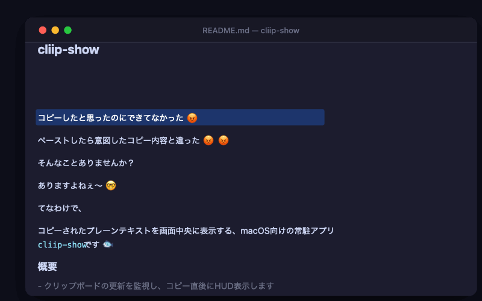

# cliip-show

コピーしたと思ったのにできてなかった 😡

ペーストしたら意図したコピー内容と違った 😡 😡

そんなことありませんか？

ありますよねぇ〜 🤓

てなわけで、

コピーされたプレーンテキストを画面中央に表示する、macOS向けの常駐アプリ`cliip-show`です 🐟

## 概要

- クリップボードの更新を監視し、コピー直後にHUD表示します
- HUDは数秒で自動的にフェードアウトして消えます
- アプリはバックグラウンドで常駐して動作します

### 動作イメージ


## 動作環境

- macOS（AppKitを使用）
- Homebrew（通常利用時のインストール手段）

## インストール手順 （Homebrew経由）

```bash
brew install somei-san/tap/cliip-show
brew services start cliip-show
```

## 表示設定

Homebrewアプリとしての通常運用では、設定ファイルに保存して管理します。

初期化と確認:

```bash
cliip-show --config init
cliip-show --config show
```

設定値を保存:

```bash
cliip-show --config set hud_duration_secs 2.5
cliip-show --config set hud_fade_duration_secs 0.5
cliip-show --config set max_lines 3
cliip-show --config set hud_position top
cliip-show --config set hud_scale 1.2
cliip-show --config set hud_background_color blue
```

設定キー:
- `poll_interval_secs`（既定値: `0.3`、`0.05` - `5.0`）
- `hud_duration_secs`（既定値: `1.0`、`0.1` - `10.0`）
- `hud_fade_duration_secs`（既定値: `0.3`、`0.0` - `2.0`、`0.0` でフェードなし）
- `max_chars_per_line`（既定値: `100`、`1` - `500`）
- `max_lines`（既定値: `5`、`1` - `20`）
- `hud_position`（既定値: `top`、`top` / `center` / `bottom`）
- `hud_scale`（既定値: `1.1`、`0.5` - `2.0`）
- `hud_background_color`（既定値: `default`、`default` / `yellow` / `blue` / `green` / `red` / `purple`）

環境変数でも上書き可能です（設定ファイルより優先）。

```bash
CLIIP_SHOW_HUD_DURATION_SECS=2.5 \
CLIIP_SHOW_HUD_FADE_DURATION_SECS=0.5 \
CLIIP_SHOW_MAX_LINES=3 \
CLIIP_SHOW_HUD_POSITION=top \
CLIIP_SHOW_HUD_SCALE=1.2 \
CLIIP_SHOW_HUD_BACKGROUND_COLOR=blue \
cargo run
```

設定ファイル:
- 既定パス: `~/Library/Application Support/cliip-show/config.toml`
- パス変更: `CLIIP_SHOW_CONFIG_PATH=/path/to/config.toml`

## ドキュメント

- [開発者向け手順](docs/DEVELOPMENT.md)

## Homebrew tap リポジトリ

<https://github.com/somei-san/homebrew-tap>
